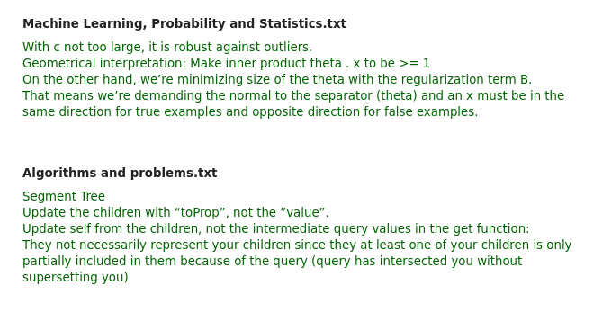
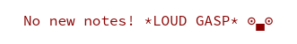

# Digest
Your changes to your google docs notes in your mailbox.

# Installation
```
go get -v github.com/farnasirim/digest/cmd/digest
go install github.com/farnasirim/digest/cmd/digest
```

## Usage
Have a look at
```
digest --help
```
First time usage:
Unfortunately setting up the google docs access token takes a few clicks and 
keystrokes. See 
[my blog post](https://blog.farnasirim.ir/2019/01/changes-to-my-notes-in-google-docs-sent.html)
for full instructions.
```
mkdir -p ~/.digest/auth/
cp $PATH_TO_GOOGLE_DRIVE_CREDENTIALS ~/.digest/auth/
 digest --folder=$GOOGLE_DRIVE_FOLDER_NAME \
--smtp-user=you@domain.com \
--smtp-pass=yourpass \
--smtp-server-host=smtp.domain.com \
--persist-confs
```
Subsequent usages:
```
digest
```

Sample output:
```
Looking under folder "subjects" with id "folder-id"
Successfully written "Theoretical Computer Science" "doc-id"
Successfully written "Networks" "doc-id"
Successfully written "Scientific Papers" "doc-id"
Email sent successfully
```

Sample email content: <br>


Or when you haven't had any changes <br>



## License
MIT
